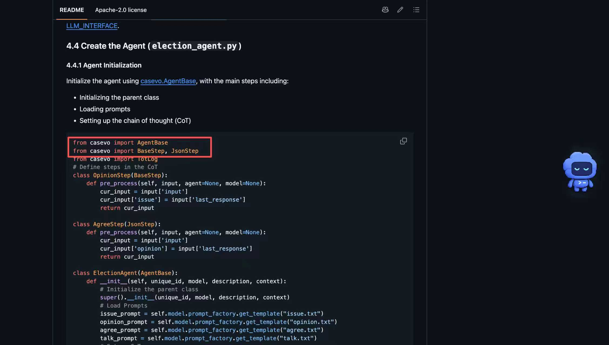

# SMP 2026常见问题解答

## 一、 评测机制与成绩结算

**Q1：提交代码后什么时候能出成绩？如果报错了怎么办？**

**A**：目前系统采用 **T+2 延时评测**（即每个赛段结束后的两天才统一给出成绩，例如初赛1的成绩在9月10日-11日出）。当前规则下，各阶段仅取**最后一次提交**进行评测。

**【重要预告】**：针对大家反馈的“报错无法及时修复”问题，组委会暂定**于下周一（9月7日）改为【实时自动化评测】**。届时每次提交（每日限3次提交）都会实时返回运行状态和成绩，请留意群内最新通知。

**Q2：比赛调用大模型（LLM）的 Token 费用是谁来承担？代码里要写 API Key 吗？**

**A**：

- **本地部署测试**：需选手在 local\_test.py 中填写**自己的** API Key，费用自理。
- **线上系统提交**：评测机调用大模型的 Token 费用完全**由主办方承担**。选手打包提交的 ZIP 代码中**无需且严禁**包含个人的 API Key，系统会自动注入官方凭证。

**Q3：环境限制参数（API 调用上限、步数限制）到底是多少？**

**A**：local\_test.py 和 README.md 中的“50次/50步”是早期内测版 SDK 的占位保护参数。**真实的线上环境限制如下：**

- **初赛**：最大 LLM 调用限制为 **120 次**。
- **复赛**：最大 LLM 调用限制为 **250 次**。

*(注：超出限制将被系统强制熔断判负，请在本地使用图论算法精简 LLM 调用。)*

## 二、 赛题逻辑与推演细节

**Q4：赛题中说“从官方话术库选择预设策略”，请问共有几条？具体数值是多少？**

**A**：官方话术库固定有 **3 个**预设策略（即 prompt\_id 可选 1, 2, 3）。其具体对应的倾向修正数值对选手是**黑盒隐藏**的，需要您的智能体根据节点的反馈自行摸索和选择最优话术。

**Q5：本地代码中当 budget < 2.0 就结束了，为什么不是 > 0？**

**A**：因为在干预操作中，最便宜的实质性操作（话术游说）需要消耗 2.0 精神力。如果预算降到 2.0 以下，只能执行单纯的侦察（Scan），而侦察无法改变网络节点状态。为防止死锁，系统物理引擎会在预算不足 2.0 时强制熔断并进入结算。

**Q6：推演结算（第3步）和单种子得分计算（第4步）是一回事吗？本地测试能体现推演过程吗？**

**A**：**不是一回事**。

- 第3步是动态物理过程：在您干预结束后，系统会将此时的网络拓扑，用网络共识算法（度数越高影响力越大）进行**一定轮次动态迭代至稳态**。
- 第4步是计算结果：在稳态后提取数值计算最终得分。

本地测试的 env.trigger\_eval() 并没有跳过第 3 步，而是**向官方服务器触发了这一定轮次结算**，您得到的最终得分已经是推演收敛后的真实结果。

## 三、 环境配置与依赖包问题

**Q7：运行本地测试时报错 ModuleNotFoundError: No module named 'agent\_mesa' 怎么办？**

**A**：agent\_mesa 是必须的第三方 Python 库，最新版本改名为casevo。

- **解决方法**：请在本地环境中运行 pip install agent\_mesa / pip install casevo，或前往官方 GitHub 仓库下载源码/安装包至本地：<https://github.com/rgCASS/casevo>。



## 四、 本地沙盒服务器（Bug修复通报）

*(注：以下问题均已在远端服务器完成热修复，选手****无需修改 SDK 代码****，直接重新运行即可)*

**Q8：本地测试时，无论怎么修改 JSON 文件，精神力总预算始终返回 20？**

**A**：已热修复。现在 SDK 会正确读取 custom\_seeds/my\_test\_network.json 中的 max\_budget 字段，选手可自由修改测试。

**Q9：/api/scan 返回的节点数据中缺失了 comm\_left（剩余沟通次数）字段？**

**A**：已热修复。现在首次扫描节点时，已能正常返回 comm\_left 字段。

**Q10：本地测试调用 /api/start\_session 创建远程 session 失败，或出现跨请求 HTTP 异常报错？**

**A**：已热修复。此前由于公网高频扫描与 Gunicorn 负载均衡（请求打到不同进程导致内存状态丢失）发生碰撞。现官方服务器已升级为高并发模型（单 Worker 多线程），状态机已完全稳定。地址和鉴权方式未变，选手可正常发起高并发测试。

## 五、 测试环境已安装的python包

```text
certifi==2022.12.7
charset-normalizer==3.1.0
chromadb==0.5.5
cmake==3.26.3
filelock==3.12.0
fsspec==2023.6.0
huggingface-hub==0.16.4
idna==3.4
Jinja2==3.1.2
joblib==1.3.1
lit==16.0.2
MarkupSafe==2.1.2
mesa==2.3.2
mpmath==1.3.0
networkx==3.1
numpy==1.24.3
packaging==23.1
pandas==2.0.3
Pillow==9.5.0
protobuf==4.23.4
python-dateutil==2.8.2
pytz==2023.3
PyYAML==6.0.1
regex==2023.6.3
requests==2.29.0
safetensors==0.3.1
scikit-learn==1.3.0
scipy==1.11.1
sentencepiece==0.1.99
six==1.16.0
sympy==1.11.1
threadpoolctl==3.2.0
tokenizers==0.13.3
torch==2.0.0
torchaudio==2.0.0
torchvision==0.15.0
tqdm==4.65.0
transformers==4.31.0
triton==2.0.0
typing_extensions==4.5.0
urllib3==1.26.15
```
